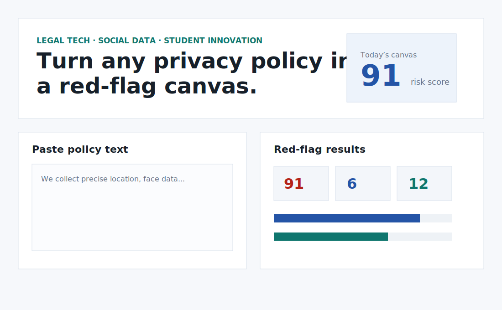
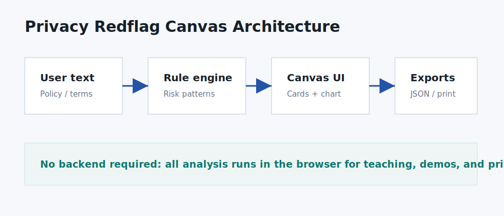

# Privacy Redflag Canvas

[中文文档](README.zh-CN.md)

Turn any privacy policy into a red-flag checklist, evidence table, and printable canvas for legal-tech education, social research, and student innovation projects.



> Disclaimer: this is an educational and research tool, not legal advice. It does not replace a lawyer, regulator, or qualified professional.

## Why It Matters

People click through privacy policies because the documents are long, vague, and hard to compare. Privacy Redflag Canvas gives students, journalists, NGOs, and consumer-rights educators a fast way to identify clauses worth asking about.

## Features

- Browser-only privacy policy scanner
- Red-flag risk score and category chart
- Evidence table with matched phrases and follow-up questions
- JSON export for research notes
- Print-ready report
- Demo assets and a student innovation-project BP document

## Quick Start

Open `index.html` in a browser, or run a local static server:

```bash
python3 -m http.server 8080
```

Then open:

```text
http://localhost:8080
```

## Example Use Cases

- Law students comparing app privacy policies
- Social science classes teaching platform governance
- Journalists building a red-flag checklist before interviews
- NGOs preparing consumer-rights workshops
- Student teams applying for innovation and entrepreneurship projects

## Architecture



## Project Proposal / BP

The repository includes a Word proposal generated with `python-docx`:

```text
docs/innovation_project_bp.docx
```

It includes project background, users, innovation points, technical route, social value, implementation plan, risks, and expected outcomes.

## Roadmap

- Add multilingual policy pattern packs
- Add jurisdiction-specific checklists
- Add CSV batch comparison
- Add shareable public-interest report templates

## License

MIT
